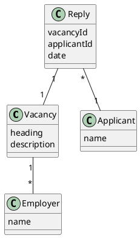

```plantuml

@startuml

class Vacancy {
  heading
  description
}

class Reply {
  vacancyId
  applicantId
  date
}

class Employer {
  name
}

class Applicant {
  name  
}

Reply "*" -- "1" Applicant
Reply "1" -- "1" Vacancy
Vacancy "1" -- "*" Employer

@enduml

```